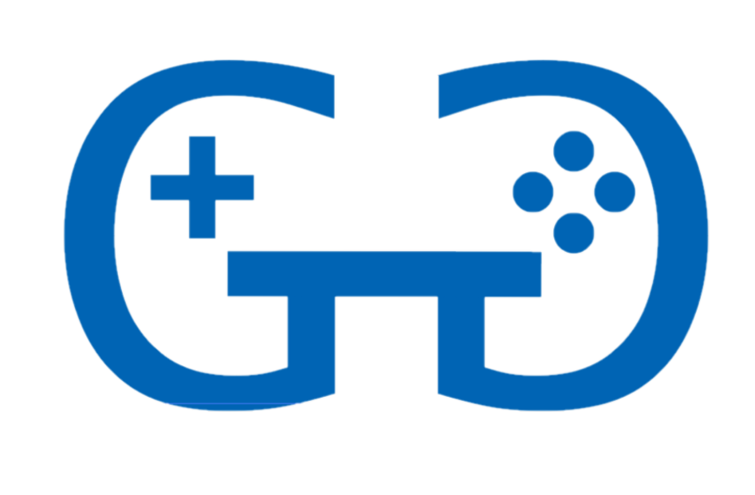
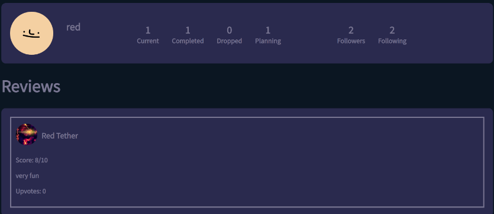
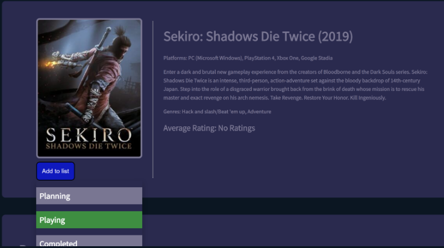
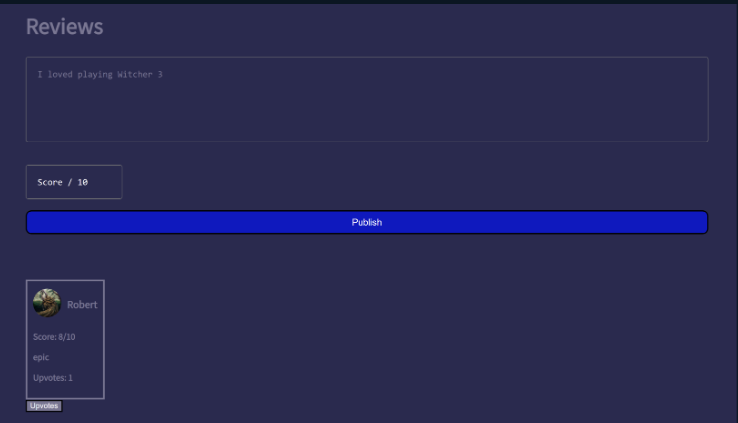

# GameGate

[Website Link](https://gamegate.netlify.app)

## Overview
GameGate is a social media app designed to enhance the gaming experience by providing features for tracking and reviewing games, as well as connecting with fellow gamers. The platform enables users to not only share their gaming activity but also connect with friends to witness each other's gaming history.

**Project Duration:** 4 months

## Notice
Due to costs for hosting the backend and data storage, the website is currently not functioning as intended. We are actively working on finding alternative storage and hosting options to restore the full functionality of the platform.

## User Stories and Team Roles

- **Anthony:** User Profiles, Upvotes, AWS Database, Account Management, Following/Follower Systems, Reviews, Login/Logout, User Categorization of Games, Global/Following Feed.
- **Robert:** Internet Game Database API Integration for game search, Persistence for review upvoting, Password hashing, JWT/Refresh tokens.
- **Hollys:** Upvote design, Game status interface, Navigation bar.
- **Mohammed:** Front-end hosting on Netlify, Character limit on reviews, Landing page format, Review display.

## Completed Functionality

- [x] User can sign up and login.
- [x] User passwords are encrypted for security.
- [x] Users can set up profiles.
- [x] Users can search for and connect with other users.
- [x] Users can categorize games as Completed, Current, Dropped, or Planning.
- [x] Users can leave game reviews.
- [x] Users can upvote reviews.
- [x] Users receive push notifications.
- [x] Global feed displaying the site's activity.
- [x] Personal feed showing following activity upon user login.

## Technologies and Services Used

**AWS Services:**
- DynamoDB
- Amazon Cognito

**Hosting Services:**
- Netlify
- Heroku

## Usage

1. Visit the [GameGate website](https://gamegate.netlify.app).
2. Sign up or log in to your account.
3. Explore games, leave reviews, and connect with other gamers.

## Team Collaboration

Our team worked collaboratively on various aspects of the project, leveraging our individual skills to create a comprehensive gaming-focused social platform.

## Screenshots

*Profile and Reviews*

*Game and Categories*

*Review Box and Upvotes*

## Acknowledgments

We want to express our gratitude to the Internet Game Database for its API, which allowed us to integrate game information seamlessly into our platform.

---

For more details, check out the [server-side code](https://github.com/RobertBangiyev/GameGate-Server).
